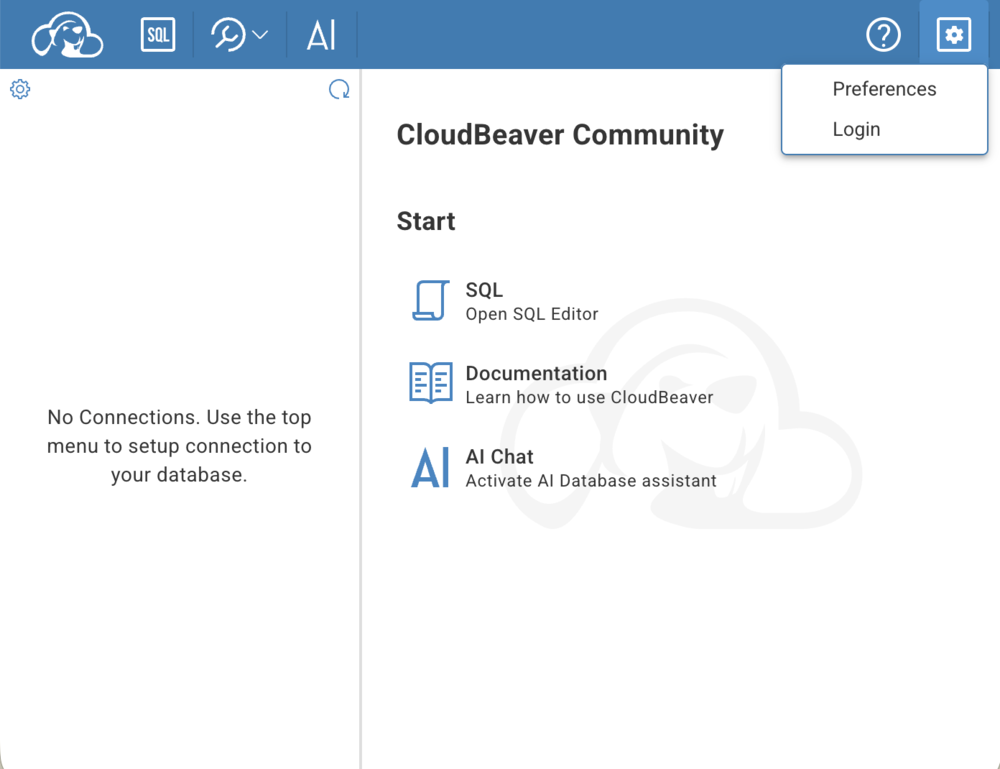
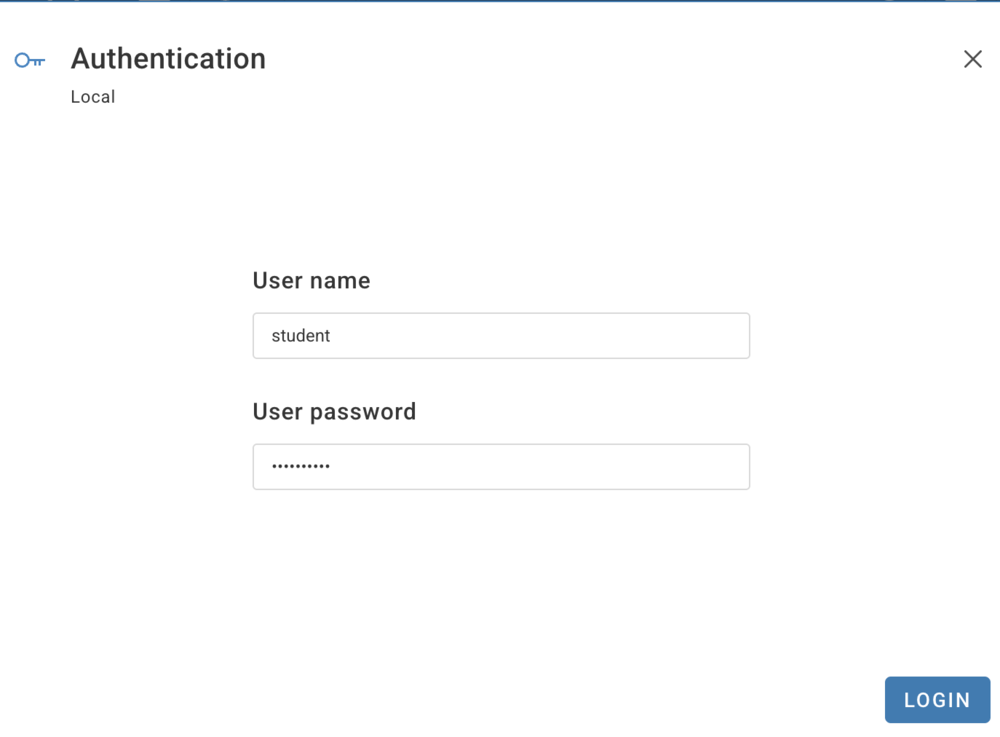
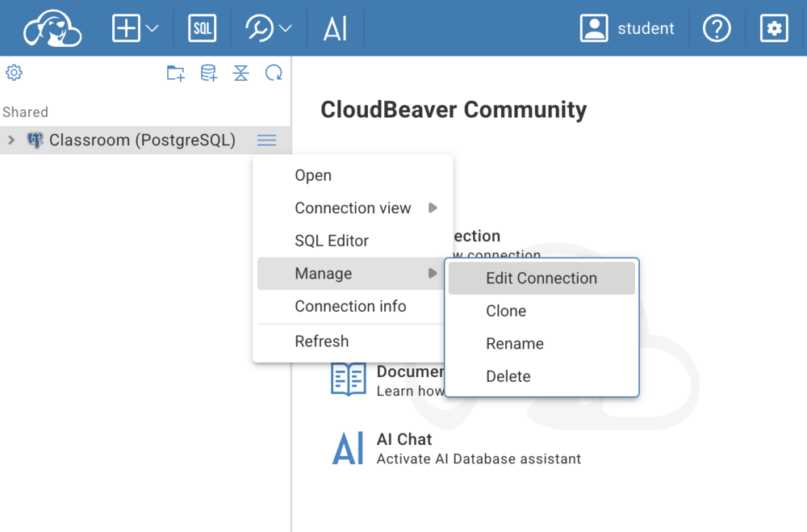
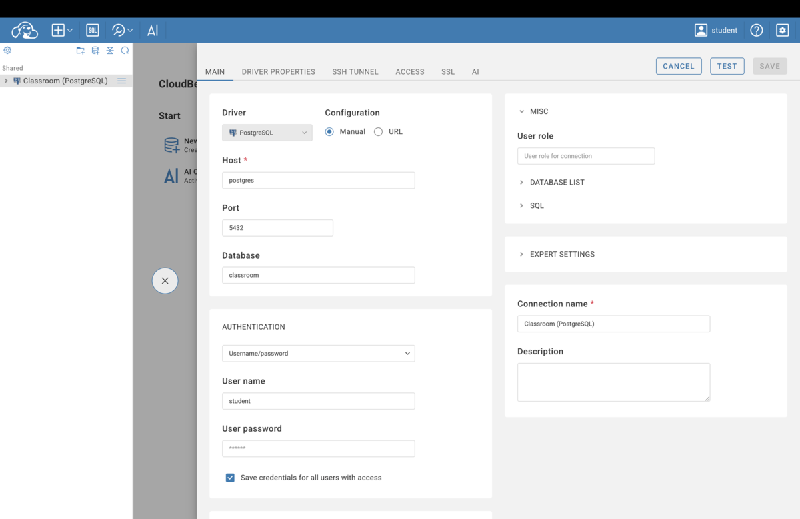

# Using CloudBeaver — the SQL workbench in your browser

CloudBeaver (<http://localhost:8978>) is a database client that runs in the
browser. It is the comfortable way to look at the class database and to write
SQL against it.

> **Two different logins are involved — that is the one confusing thing here.**
> First you log in to **CloudBeaver itself** (`student` / `Kingo2026!`), and
> once, on first use, you give it the **database's** password
> (`student` / `kingo2026`). Different passwords, on purpose.

## 1. Log in to CloudBeaver

Open <http://localhost:8978>. The first page says **"No Connections. Use the
top menu to setup connection to your database."** — that is normal, it just
means you are not logged in yet.

1. Click the **gear icon** in the top-right corner.
2. Choose **Login**.

   

3. User name **`student`**, password **`Kingo2026!`**, then **LOGIN**.

   

Your name now appears in the blue bar, and the left panel shows **Shared →
Classroom (PostgreSQL)**. (The connection is pre-made for you — you never have
to create one.)

## 2. Give it the database password — once

Click **Classroom (PostgreSQL)**. CloudBeaver asks for the database
credentials. If it does not ask, click the **≡ menu** next to the connection →
**Manage → Edit Connection**:

You land on the **MAIN** tab. Everything except the password is already filled
in — check that it says **Database `classroom`** (that is the class database;
the server also holds the internal databases of Langflow, n8n and Metabase,
which you should leave alone), then type the password:

| Field | Value |
|---|---|
| Host | `postgres` |
| Port | `5432` |
| **Database** | **`classroom`** |
| Authentication | Username/password |
| User name | `student` |
| User password | `kingo2026` |
| Save credentials for all users with access | **tick it** |

Then **TEST** (should say the connection works) and **SAVE** — both buttons sit
at the top right. You only do this once: CloudBeaver remembers it from then on.

## 3. Look at the data

Expand **Classroom (PostgreSQL) → classroom → Schemas → public → Tables**.
The class sample data is there: `products`, `customers`, `orders`. Double-click
a table to see its rows.
