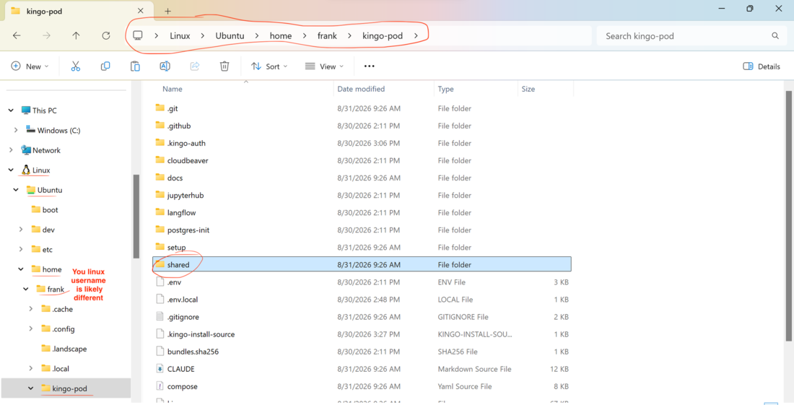
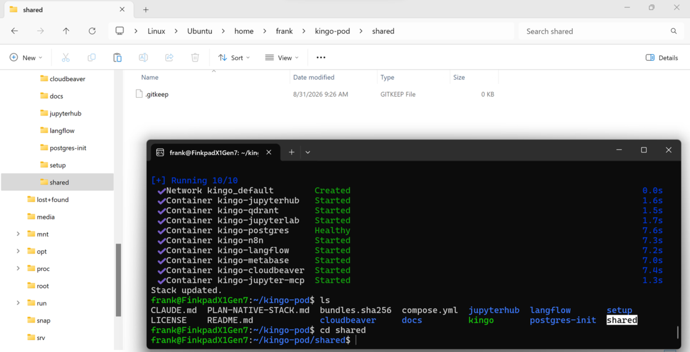

# Kingo Classroom — using the stack on Windows

Setup is done and the script printed `SMOKE OK`. This page is everything that
comes after: your addresses and logins, the handful of commands you need, how
to get your own files in and out, how to update, and what to do when something
goes wrong. Bookmark it — you won't need the setup guide again.

Everything with a `./kingo` in it is typed in the **Ubuntu** app, inside the
`kingo-pod` folder.

> **Jump to:** [Your services](#your-services) ·
> [Everyday use](#everyday-use) · [Your files](#your-own-files--the-shared-folder) ·
> [Update](#keeping-up-to-date) ·
> [If something breaks](#if-something-breaks) · [FAQ](#faq)

## Your services

Use your normal **Windows** browser — WSL2 forwards `localhost` from Ubuntu to
Windows automatically. If setup had to move a port your addresses differ from
the defaults below — `./kingo credentials` always prints the truth for your own
laptop:

| Service | Address | Login |
|---|---|---|
| Langflow | <http://localhost:7860> | none (logs in automatically) |
| n8n | <http://localhost:5678> | create your own account on first visit |
| JupyterLab | <http://localhost:8888> | none |
| JupyterHub | <http://localhost:8000> | any username + password `kingo2026` |
| Metabase | <http://localhost:3000> | `admin@kingo.local` / `Kingo2026!` |
| CloudBeaver | <http://localhost:8978> | `student` / `Kingo2026!` — [how to connect](CLOUDBEAVER.md) |
| Qdrant | <http://localhost:6333/dashboard> | none |
| PostgreSQL | `localhost:5432` | `student` / `kingo2026` (db: `classroom`) |

> **CloudBeaver looks empty at first** ("No Connections") — you have to log in
> via the **gear icon → Login** before the class database shows up, and give it
> the database password once. Two minutes, step by step:
> [Using CloudBeaver](CLOUDBEAVER.md).

MCP (*Model Context Protocol*) is how AI assistants such as Claude Desktop,
Claude Code, or Cursor connect to tools. Point yours at the Jupyter MCP
endpoint `http://localhost:4040/mcp` (header
`Authorization: Bearer kingo-mcp-2026`) and it can write and run code in the
class notebook for you. `./kingo mcp` prints exactly this.

**OpenCode** (AI coding in the terminal) runs inside your Ubuntu — install it
once with:

```bash
curl -fsSL https://opencode.ai/install | bash
```

then run `opencode`. The first run asks for an API key; change it anytime with
`opencode auth login`.

## Everyday use

Open the **Ubuntu** app and go to the class folder:

```bash
cd kingo-pod
```

then one command per job:

| Command | What it does |
|---|---|
| `./kingo up` | start everything (your data stays between runs) |
| `./kingo down` | stop everything |
| `./kingo status` | which services are up? |
| `./kingo credentials` | my addresses + logins |
| `./kingo doctor` | something's wrong? start here |
| `./kingo version` | which version am I running? (send this when you ask for help) |
| `./kingo update` | get the newest class files + images (run it when the instructor announces an update) |

> **What if I just close the Ubuntu window?** Nothing breaks — the stack
> keeps running in the background: your services stay reachable in the
> browser, and it keeps using ~5 GB RAM. It stops only when you run
> `./kingo down` or shut down / restart Windows. Your data survives all of
> these — closed windows, `down`, reboots. After a reboot, open Ubuntu and
> run `./kingo up` again. (Docker Desktop users: the stack may come back by
> itself when Docker starts — `./kingo status` shows what's up.)

### Your own files — the `shared` folder

Your own data files — a CSV, an Excel sheet, a PDF — go into the **`shared`
folder inside `kingo-pod`** (`~/kingo-pod/shared`). Langflow sees the same
folder as **`/app/shared`** — so a file you drop in as
`~/kingo-pod/shared/sales.csv` is `/app/shared/sales.csv` in a Langflow
component, and anything Langflow writes there appears on your laptop, in
the Ubuntu home folder. The folder is created for you; if it isn't there
yet, run `./kingo update` once.

**Where is that folder in Windows?** Ubuntu's files show up in File Explorer.
Open Explorer and follow the left sidebar: **Linux → Ubuntu → home → *your
Linux user name* → kingo-pod → shared** (the one you picked when Ubuntu first
started, so your folder is called something else than `frank` below). You can
also paste `\\wsl.localhost\Ubuntu\home\` into the address bar and click
onwards from there.



Drag files in and out like in any other folder — Langflow sees them
immediately, and files Langflow writes appear here.



Quickest way to get there, from Ubuntu — this opens the folder in Explorer:

```bash
cd ~/kingo-pod/shared && explorer.exe .
```

Then right-click **shared** in Explorer's sidebar → **Pin to Quick access**,
and it is one click away from then on.

Treat the folder as **shared with Langflow**: anything running inside Langflow
— including a flow someone else built and you imported — can read, change and
delete files there. So keep private files out of it, and never let it hold the
only copy of something. Nothing outside this one folder is reachable from
Langflow.

> **Using Docker Desktop?** Files that *Langflow itself* writes into the
> folder end up owned by `root` inside Ubuntu — deleting those needs
> `sudo rm`. Files **you** put in are never affected. With Podman (the
> default) this does not happen.

## Keeping up to date

**One line brings your installation up to date** — newest class files, images
and rebuilt containers. Safe to run any time in Ubuntu, from any folder:

```bash
cd ~/kingo-pod && ./kingo update
```

Run it whenever your instructor announces an update. It works for every
install, however old — nothing has to be downloaded by hand.

## If something breaks

**Always start with one command** (in Ubuntu, inside `kingo-pod`) — it checks
the usual suspects and tells you what to do:

```bash
./kingo doctor
```

| What you see | What to do |
|---|---|
| `Cannot connect to the Docker daemon at unix:///run/user/…/podman.sock` | Podman's API socket is off. Run `systemctl --user enable --now podman.socket`, then `./kingo up`. (Current versions of setup and `kingo` do this automatically — `git pull` gets you there.) |
| `Other software on this machine is already using ports Kingo needs` | Run `./kingo fixports`, then `./kingo up`. Kingo moves itself to free ports — your other software is untouched. Your addresses change; `./kingo credentials` shows the new ones. |
| Same message right **after** `./kingo down`, but you started nothing new | No real collision — the port forwarding didn't let go. First just run `./kingo up` again (current `kingo` frees such leftovers where it can — get it: `./kingo update`). If it persists: `./kingo fixports` moves past it, or run `wsl --shutdown` in Command Prompt (Windows) and reopen Ubuntu — **note**: that stops everything running in WSL (including Docker Desktop's backend), not just Kingo. |
| `The Kingo stack is ALREADY RUNNING under your other engine` | Nothing is broken — the stack is up under your other container engine. Follow the two commands the message prints. |
| `ALL of Kingo's ports are busy` | The stack is most likely **already running** (possibly under your other engine). Run `./kingo status` — if services show `up`, you're done, nothing is wrong. |
| I have Docker Desktop, but setup installed Podman | Docker wasn't running or its WSL integration was off during setup. Both engines work — no need to change anything. To switch anyway: turn on WSL integration for Ubuntu, then `./kingo down` (stops the Podman stack **first**), then `echo KINGO_ENGINE=docker >> .env.local`, then `./kingo up`. |
| Laptop feels slow (8 GB machines) | The stack needs ~5 GB RAM. Close other apps. If it stays bad, create the file `C:\Users\<you>\.wslconfig` **in Windows** containing `[wsl2]` on one line and `memory=5GB` on the next, run `wsl --shutdown` in PowerShell, then start the stack again. |
| Ubuntu terminal says `./kingo: No such file or directory` | You're in the wrong folder. Run `cd ~/kingo-pod` first. |
| Anything else | `./kingo down`, then `./kingo up`. If it persists: screenshot the error and ask the instructor / TA. |

## FAQ

**Why Podman and not Docker?** They do the same job and this stack runs
identically on both (our tests run on both, every day). We default to Podman
because it's fully open-source and free for everyone — Docker Desktop's
license requires payment at larger companies, and we don't want the tooling
you learn to expire with your student status. **If Docker Desktop is already
on your laptop, the setup script simply uses it** — you are not missing
anything either way.

**I already use Docker / have my own database. Will this break my stuff?**
No. Kingo runs in its own containers (all named `kingo-…`) with its own
storage. The only possible overlap is a port number — and setup/`fixports`
resolves that automatically by moving *Kingo*, never your software.

**The passwords are printed in a public repo?!** Yes, on purpose. Every
service is reachable **only from your own laptop** (`127.0.0.1` — people on
the same Wi-Fi cannot connect; WSL2's localhost forwarding keeps it that way).
So these are classroom conveniences, not secrets. The one real rule: the class
shares an n8n encryption key, so **never put a real API key into an n8n
workflow you share or export.**

**Where is my data?** Databases, notebooks, and workflows live in container
volumes inside WSL2 and survive `./kingo down` and reboots. Only
`./kingo reset` deletes them (it asks first).

**Can I use extra Python packages (say, statsmodels)?**

- **JupyterLab** (`:8888`) already ships the data-science standards —
  pandas, statsmodels, scikit-learn, seaborn, and friends. For anything
  else, run `%pip install <package>` in a notebook cell (repeat it if the
  stack was restarted since).
- **Langflow**: the class set (statsmodels, …) is built in — `import
  statsmodels` just works in Python components. Need one more?
  `./kingo langflow pip install <package>` installs it on the spot; it lasts
  until the next `./kingo down` + `up`, so run it again after that (or ask
  the instructor to add it for everyone).
- **JupyterHub** (`:8000`) starts a minimal Python *without* the data
  packages — use `%pip install` there too, or simply do data work in
  JupyterLab.

**Where are my Windows files inside Ubuntu?** Your Windows drives are mounted
under `/mnt` — e.g. `C:\Users\you\Documents` is `/mnt/c/Users/you/Documents`.

## How it all fits together

```
┌─ Your laptop (Windows) ────────────────────────────────────┐
│                                                            │
│   Browser, KNIME (on Windows)                              │
│       │  always talk to  localhost:<port>                  │
│       ▼  (WSL2 forwards localhost into Ubuntu)             │
│  ┌─ Ubuntu on WSL2 (Windows' built-in Linux) ─────────┐    │
│  │                                                    │    │
│  │   container engine (Podman or Docker) runs one     │    │
│  │   container per service:                           │    │
│  │   [Langflow] [n8n] [JupyterLab] [Metabase] ...     │    │
│  │       │        │                                   │    │
│  │       └────────┴──► [PostgreSQL]   [Qdrant]        │    │
│  │                                                    │    │
│  │   containers reach each other by service NAME:     │    │
│  │   postgres:5432, qdrant:6333                       │    │
│  └────────────────────────────────────────────────────┘    │
└────────────────────────────────────────────────────────────┘
```

Two address rules cover everything:

1. **From your laptop** (Windows browser, KNIME): always `localhost:<port>`.
2. **From one service to another** — e.g. an n8n workflow or Langflow flow
   connecting to the database: use the *service name* as host, **not**
   localhost. PostgreSQL: host `postgres`, port `5432`, database `classroom`,
   user `student`, password `kingo2026`. Qdrant: `http://qdrant:6333`.
   (Inside a container, `localhost` means the container itself — the most
   common mistake. Rule 2 is also why moved host ports never affect
   service-to-service connections.)

## KNIME (optional)

KNIME runs on **Windows** itself, not inside Ubuntu: download **KNIME
Analytics Platform** from <https://www.knime.com/downloads> and install it
like any other program. To use the class database, create a PostgreSQL
connection with host `localhost`, port `5432` (or your moved port from
`./kingo credentials`), database `classroom`, username `student`, password
`kingo2026`. The stack must be running (`./kingo up` in Ubuntu) while you use
it.
